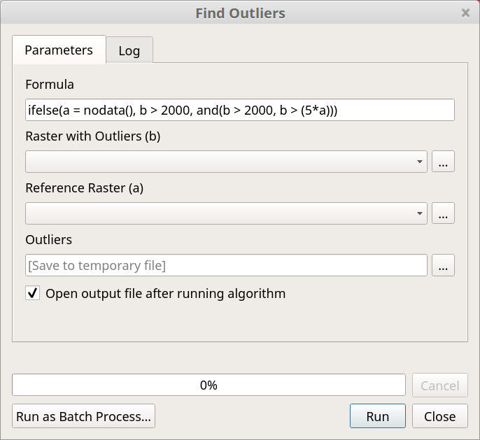

# qgismodels

- May these created processing models be of help to you
- Be aware that some models depend on each other
- Add a model via `Model` > `Add Model to Toolbox` in the Processing Toolbox

<!--

-->
<!--
- [Find Outliers](find-outliers.model3)
- -->